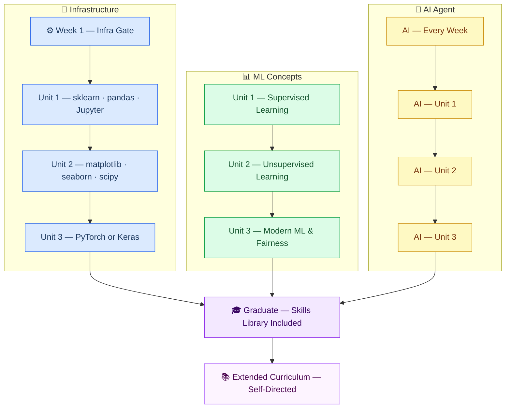

# DATA 322 — Machine Learning for Data Science
### Proposal for Spring 2027 | Cal Poly Humboldt

---

---

## Why This Course

AI is the future of how technical work gets done, and students who graduate without knowing how to work alongside it will be behind from day one.

The second reason comes from the industry side. Engineers consistently reach mid-to-senior level before they develop the ability to build and own their own infrastructure — not because the concepts are hard, but because coursework environments are provided and disappear when the course ends. This course is designed by a working industry professional who has seen that gap firsthand. Infrastructure is treated as a first-class deliverable from day one: every student exits Week 1 with a working local environment, a version-controlled project repo, and a configured AI toolchain they own. The goal is that what they learn here, they can keep practicing on their own — indefinitely.

---

## The Teach With AI Component

This section is proposed as a **Teach With AI pilot** — AI assistance is fully permitted on all project work and actively encouraged. Accountability comes from two places: three closed-resource in-class conceptual tests (no code, no AI) and a **collaboration log** submitted with every project documenting what the student asked, what the AI got right, and where the student had to push back.

The collaboration log inverts the usual concern. Students are required to surface AI use, not hide it — and a log that catches and documents an AI error is stronger than one that shows passive acceptance of correct answers. The tests provide the floor: understanding, not just output.

The agent skills library ships with the student. They can run Socratic drills on any course topic after graduation, at any depth. The course ends; the tutor doesn't.

---

## Extended Curriculum

The 15-week core is stable, but a parallel library of bonus topics will be developed alongside it — modules that can be swapped in based on cohort interest or used for self-directed study after the course ends. Candidates include time series forecasting, NLP pipelines, MLOps basics, Bayesian methods, and reinforcement learning fundamentals.

---

## Supporting Materials

- **[Syllabus](syllabus-spring-2027.md)** — learning outcomes, weekly schedule, project specs, grading breakdown, AI use policy
- **[Curriculum Framework](curriculum/spring-2027-framework.md)** — 15-week topic flow with unit structure and assessment model
- **Skills Library** (`skills/`) — complete AI tutoring skills for every week, ready to deploy
- **Governance Layer** (`CLASS.md`, `manifests/`) — course documentation standard for consistent AI-assisted maintenance

---
